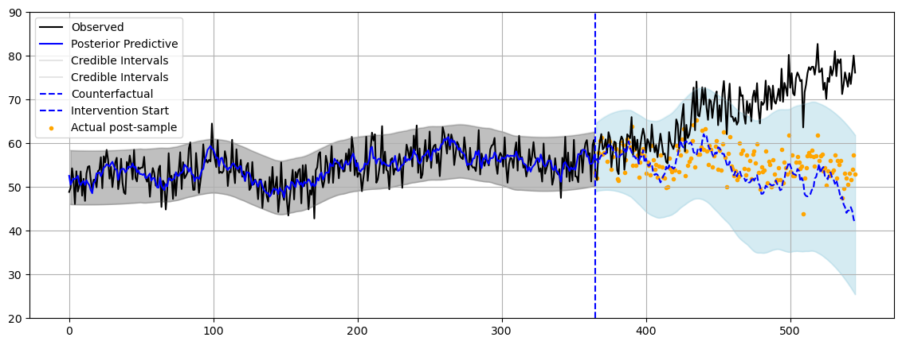
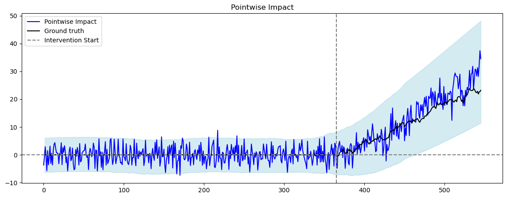
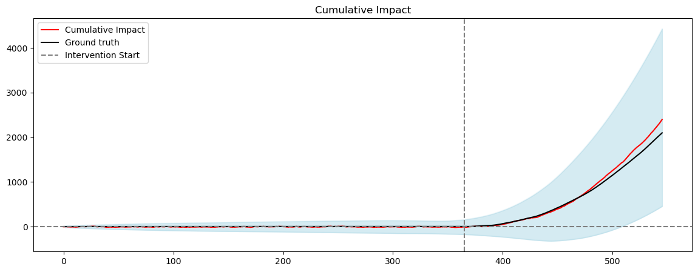

# Bayesian Causal Impact Analysis

This repository implements **Bayesian Structural Time-Series Models** to infer the causal impact of an intervention on time-series data. It follows the methodology outlined in [Brodersen et al. (2015)](https://doi.org/10.1214/14-AOAS788), where causal inference is achieved by estimating a counterfactual response using Bayesian state-space models.

By predicting what would have happened in the absence of an intervention and comparing this counterfactual with observed data, we accurately quantify **uplift effects** in synthetic datasets. Our implementation captures the cumulative impact of interventions while maintaining uncertainty quantification via posterior distributions.

## Mathematical Formulation

The model follows a **state-space representation**:

**Observation Equation**:

$$ y_t = Z_t^T \alpha_t + \epsilon_t, \quad \epsilon_t \sim N(0, \sigma^2) $$

**State Equation**:

$$ \alpha_{t+1} = T_t \alpha_t + R_t \eta_t, \quad \eta_t \sim N(0, Q_t) $$

where:
- \( y_t \) is the observed dependent variable,
- \( \alpha_t \) is the latent state vector,
- \( Z_t \) is the observation matrix,
- \( T_t \) is the transition matrix governing latent state evolution,
- \( R_t \) controls system noise,
- \( Q_t \) models latent state diffusion.

For causal impact estimation, we infer the counterfactual \( \tilde{y}_t \), then compute the **point-wise impact**:

$$ \delta_t = y_t - \tilde{y}_t $$

and **cumulative impact**:

$$ \Delta_T = \sum_{t=n+1}^{m} \delta_t $$

## Model Fit:

Model Fit & Causal Impact Analysis
The following graphs demonstrate the effectiveness of our Bayesian Structural Time-Series model in inferring causal impact from interventions on time-series data. Each visualization highlights key aspects of model performance and inference accuracy:

**Posterior Predictive Fit**

This graph compares observed values (black line) with the counterfactual predictions (blue dashed line) generated by the Bayesian model. The shaded area represents the 95% credible interval for the posterior predictive distribution, capturing uncertainty in forecasting what would have happened in the absence of intervention. A well-fitted model ensures the counterfactual trajectory aligns closely with pre-intervention behavior, minimizing overfitting while accounting for temporal trends.

    

**Pointwise Impact Estimation**

This visualization highlights the difference between observed values and their predicted counterfactuals at each time step. The impact (blue line) reflects the estimated effect of the intervention. The increasing width of credible intervals suggests greater uncertainty in longer-term predictions. If the intervention successfully drives uplift, the impact should remain significantly above zero throughout the treatment period.

    

**Cumulative Impact Analysis**

This final graph accumulates the pointwise impact estimates over time, offering insights into the total effect of the intervention. The cumulative impact curve (black line) provides a measure of sustained uplift. The shaded uncertainty band represents Bayesian credible intervals, demonstrating the confidence in effect estimation. If the cumulative impact consistently trends above zero, it indicates a persistent positive treatment effect.

    

